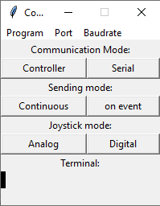

# Arduino_Controller

## Intro

This is a little project i did with a joystick breakout board, that usually would be used with the Micro:Bit platform. I got this breakout board for Christmas, however I don't have any Micro:Bit controllers (and didn't want to get into these ones), so I tried to make it compatible with Arduinos. For that, I broke off the connector on the PCB and soldered my own wires to it to connect to an Arduino Pro Micro.

## Communication and using the controller

### The LED

Below the jumper connector is a tiny groove, behind which a led is hiding. The led indicates the working mode:

1. Blink: controller mode
2. Blinks: serial with continuous data
3. Blinks: serial with data on event

The led will blink every time on when changing the modes and once at startup.

### Settings

The controller will as default act as a real controller to the computer. However, the serial port is always open (Baud: 9600), so you can apply some settings at any time:

1. **Communication mode:** The arduino can send the 'raw' data over its serial ports instead of acting like a real controller. In that mode, the arduino sends all data both over USB and the jumper connectors next to it at the same time, as they are the same port. More on how to process the incoming data later. You can change between these modes by simply sending `com_mode=controller` or `com_mode=serial`.
2. **Sending mode:** In serial mode, you can change between a continuous data stream with all data and data on event, which means the arduino only sends somethings, when something changed. Change this with `sending_mode=continuous` and `sending_mode=onEvent`.
3. **Joystick mode:** Sometimes having a D-pad is more useful than a joystick. For this case, you can switch between analogue and digital values for the Joystick. This settings only makes a difference in controller mode. In serial, both the analogue and digital values are send, more info on that below. That setting is changed by `joystick_mode=analog` and `joystick_mode=digital`.

The arduino will always respond with the setting you just declared or with an error, when the command couldn't be understood. You don't have to worry about newline trailers and spaces though, these are automatically removed.

**However**, I also wrote a python script that makes is it easier to change the settings. There's also an .exe-file ready (no Installations needed, just run it). *(didn't wrote it yet, give me some time)*

### Using as Controller

It's _almost_ plug'n'play. You will need to configure it though, for example in Steam's controller settings, because an Arduino is not a standard and well-known gaming controller. You might want to configure both the Joystick and the D-pad, so you will need to change modes during the process.

### Using the serial port

As previously said, you can both use the USB-port and the jumper connectors. The pinout of the latter is seen in this picture:

The arduino has a 5V operating voltage, so be warned when combining it with a 3.3V micro-controller.

**I also might write a library for arduino that would take care of all the communicating below**.

#### continuous

The data is presented as one long string, each character representing one button. The string looks something like this: `00010010x25y-103z11000`. The order of buttons in front of the letters is as follows:
`up - down - left - right - mode - l1 - r1`
Between the letters are the analogue values, reaching from -127 to 127 (left - right and up - down, meaning a movement up returns a negative number). Because the length of these numbers can change, they are bordered by letters. `'x' - potiX - 'y' - potiY - 'z'`.
After the letters are the button inside the joystick, or "z-axis", and the digital values of the joystick for each direction:
`potiZ - potiDigUp - potiDigDown - potiDigLeft - potiDigRight`

#### onEvent

In that mode, the data is only send, when something changes. In that case, the arduino will send the name of the button (you can see the names in the picture below), followed by a number with the new value. For example: 
- `up1` (the UP-button is pressed)
- `left0` (the LEFT-button is released)
- `potiX68` (the joystick is moved about half ways to the right)

## Materials

| Item                                             | Price       | Link (on where I found it)                                   |
| ------------------------------------------------ | ----------- | ------------------------------------------------------------ |
| Arduino Pro Micro                                | 6.90€       | https://www.berrybase.de/raspberry-pi-co/arduino/boards/kompatibler-arduino-pro-micro-mit-atmel-mega-32u4-prozessor |
| Keyestudio Joystick Breakout Board for Micro:Bit | 6.41€ 9.00$ | https://www.keyestudio.com/products/keyestudio-joystick-breakout-board-for-bbc-microbit-1 |

The Arduino Pro Micro is not an official Arduino board, I think, but it uses the same processor as the Arduin Leonardo, the Atmega32u4, and appears as such. To use this board, you simply can choose the Arduino Leonardo as the board and program it rightaway.

additional material:

- 2 M3 screws, 10-15mm long
- a 3D-Printer and filament
- wires, soldering iron and tin
- two tiny breakout board push-buttons and a led

## 3D-Printing and Assembly

All the necessary .stl-files are in /cad/final. You can also find the Fusion 360 and STEP files there. For the printing I used an Anycubic I3 Mega, with silver PLA on 0.12mm layer height. All parts together took a little bit more than 24 hours, test pieces not included.

The breakout board should fit on the standoffs of the lower side part. The Led goes under the breakout board in it's hole and might needs to glued. It's then connected to GND and the Led-Pin via a resitor. The push-buttons belong in the upper part behind the shoulder buttons and are wired without any resistor, because we are using the internal INPUT_PULLUP. The micro-controller and jumper connectors belong in the upper part between the shoulder buttons. Images of the assembly and wiring diagram are in the /media/assembly folder.

## Source-Code

### Arduino-Sketch for the controller

The sketch is pretty simple and straightforward. There's one function, `blinkLed()`, everything else is done inside `void loop(){}` in that order:

1. read any incoming serial data
2. read inputs
3. sends outputs
	1. controller
	2. serial - continuous
	3. serial - on event
4. save current values as previous values

To make the arduino simulate a controller, I used the Joystick library by Matthew Heironimus (https://github.com/MHeironimus/ArduinoJoystickLibrary)

### Python-Script for easy settings

The python script is available as a pyw-file, to run it without a terminal (You can find it in the "python - driver" folder).

- You can change the port in the Port-menu and Baudrate in Baudrate-Menu (although you won't have to, both this script and the arduino are set to 9600 as standard)
- You can change the modes by clicking on the buttons. The communication usually takes a moment. You can see the changed setting in the terminal. If you don't, try again.

### Arduino library

*COMING SOON*